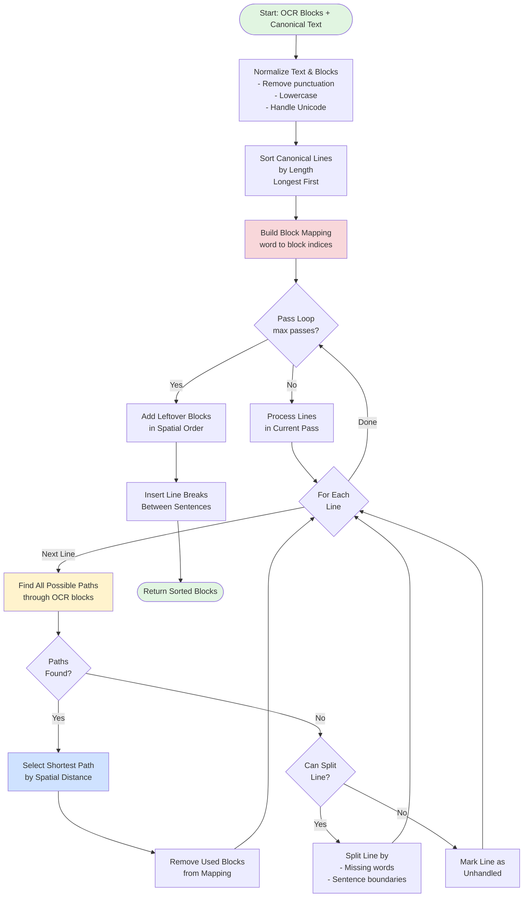
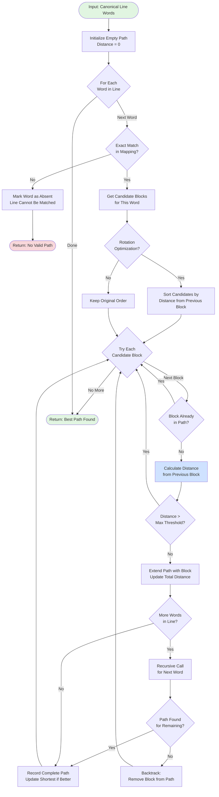
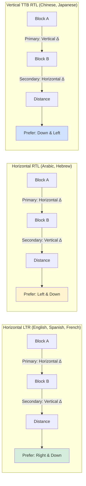
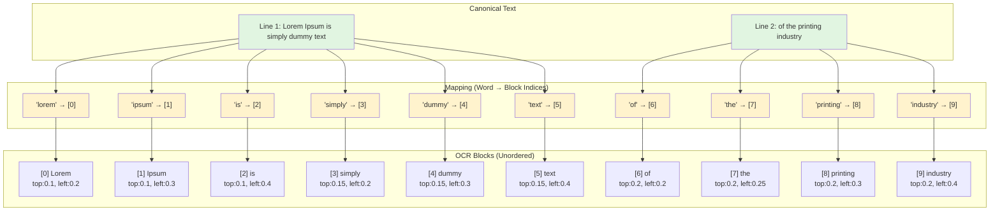
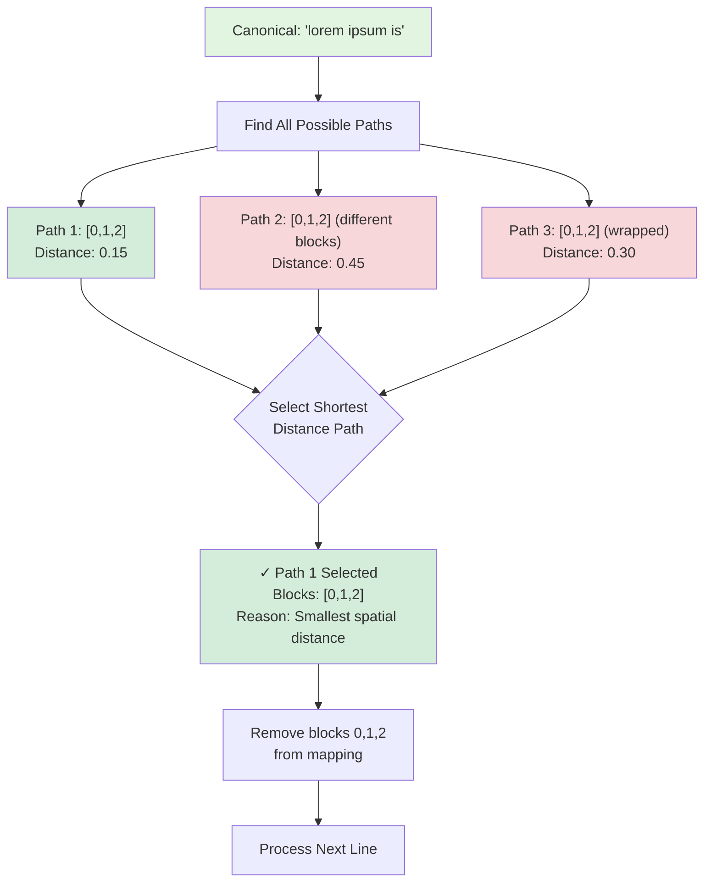
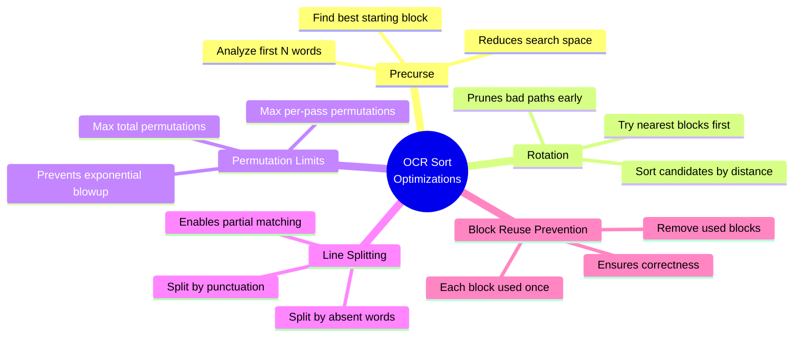
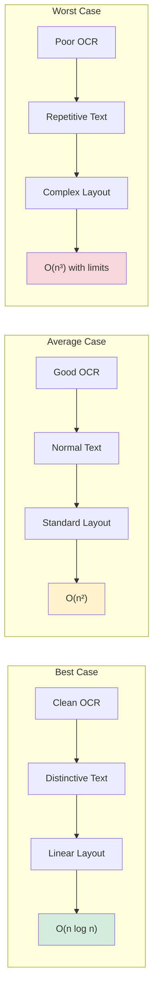

# OCR Sorting Algorithm

This document provides a visual explanation of the gollate algorithm using flowcharts and diagrams.

> **2026-07 update:** the flowcharts below describe the core pathfinding
> pipeline. Since they were drawn, four error-tolerance mechanisms were
> added inside the pathfinding stage — wrap bridging (paths may cross
> visual line wraps), wildcard holes (words missing from OCR are bridged
> instead of splitting the line), short-line anchoring (duplicated short
> lines pick the instance nearest their matched canonical neighbors), and
> a reconciliation pass (anchor-gated rescue of unfound fragments after
> the main loop). They don't change the overall flow shown here; see
> pkg/sorters/README.md ("Error-tolerance mechanisms") for how they slot in.

## High-Level Algorithm Flow

## Pathfinding Algorithm (Detailed)

## Distance Calculation (Reading Order Aware)

## Block Mapping Structure

## Path Selection Example

## Multi-Pass Strategy

```mermaid
gantt
    title Multi-Pass Line Processing Strategy
    dateFormat X
    axisFormat %s

    section Pass 1
    Long lines (16+ words)     :p1, 0, 3

    section Pass 2
    Medium lines (10-15 words) :p2, 3, 5

    section Pass 3
    Short lines (5-9 words)    :p3, 5, 7

    section Pass 4
    Very short lines (1-4)     :p4, 7, 8

    section Pass 5
    Split unmatched lines      :p5, 8, 10

    section Pass 6
    Retry with splits          :p6, 10, 11

    section Cleanup
    Add leftover blocks        :p7, 11, 12
    Insert line breaks         :p8, 12, 13
```

## Optimization Strategies

## Key Algorithm Insights

### 1. Why Longest-First?

Longer lines have more words, making them more distinctive and easier to match accurately. By finding these first, we:
- Reduce the search space for shorter lines
- Establish spatial anchors in the document
- Improve overall accuracy

### 2. Why Shortest Path?

Words that appear sequentially in canonical text should appear spatially close in the document. The shortest path represents the most natural reading order.

### 3. Why Multiple Passes?

Some lines cannot be matched in early passes due to:
- Missing words (OCR failures)
- Too many permutations (combinatorial explosion)
- Ambiguous matches (multiple valid paths)

Later passes handle these with:
- Line splitting
- Reduced permutation limits
- Different word length thresholds

### 4. Why Remove Used Blocks?

Each OCR block should appear exactly once in the output. Removing used blocks:
- Prevents duplicate text in results
- Reduces search space for subsequent lines
- Ensures logical consistency

## Performance Characteristics

## Configuration Impact

---

## References

- See [README.md](README.md) for usage examples
- See [CLAUDE.md](CLAUDE.md) for development guidelines
- See source code in `pkg/sorters/` for implementation details
